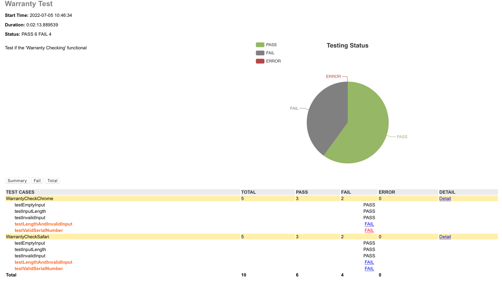

# AutoTest

## Enviroment Setup
I. Check the browser version and download the corresponding webdriver. You can find the corresponding webdriver under "webdriver" folder or download them from the following links instead.

| Browser  | Links                                                                 |
|----------|-----------------------------------------------------------------------|
| Chrome  | [https://chromedriver.chromium.org/downloads](https://chromedriver.chromium.org/downloads)                           |
| Safari  | [https://webkit.org/blog/6900/webdriver-support-in-safari-10/](https://webkit.org/blog/6900/webdriver-support-in-safari-10/)          |
| Edge    | [https://developer.microsoft.com/en-us/microsoft-edge/tools/webdriver/](https://developer.microsoft.com/en-us/microsoft-edge/tools/webdriver/) |


II. Make sure the webdriver and the "autoTest.py" are in the same directory. If you are using Windows, copy both "chromedriver.exe" and "msedgedriver.exe". If you are using macOS, copying "chromedriver" is enough.

(Note: It's no need to download webdriver for Safari browser. Instead, you have to check if the "safaridriver" is correctly under "/usr/bin/" directory.)

III. Install the required Python dependencies

## Test Strategy

For the Test Scope (Warranty checking input), I designed the following test cases:

| Test Cases                | Description                                                                                                         |
|---------------------------|---------------------------------------------------------------------------------------------------------------------|
| testEmptyInput            | Test the input checking mechanism. If the input is empty, the error message should be shown.                        |
| testInputLength           | Test the input checking mechanism. If the input length is too short, the error message should be shown.             |
| testInvalidInput          | Test the input checking mechanism. If the input contains invalid characters, the error message should be shown.     |
| testLengthAndInvalidInput | If the input length is not enough and contains invalid characters, both error messages should be shown.             |
| testValidSerialNumber     | Make sure all valid serial numbers can be found. Assume all valid serial numbers are recorded in "ValidSerial.json" |

In order to make sure the "Warranty checking function" works correctly on most browser, all test cases above will run on Google Chrome, Microsoft Edge and Safari respectively.

## Run The Test

I. Make sure the webdrivers(chromedriver and msedgedriver), autoTest.py, HTMLTestRunner_PY3.py and ValidSerial.json are in the same directory.

II. Run the "autoTest.py":

```
./autoTest.py
```
or

```
python3 autoTest.py
```
III. After running the command above, the auto test will start. The test report will be created in html format when the test is finished.

## Test Report

The html report will be created in the same directory. The report looks like the picture below:

