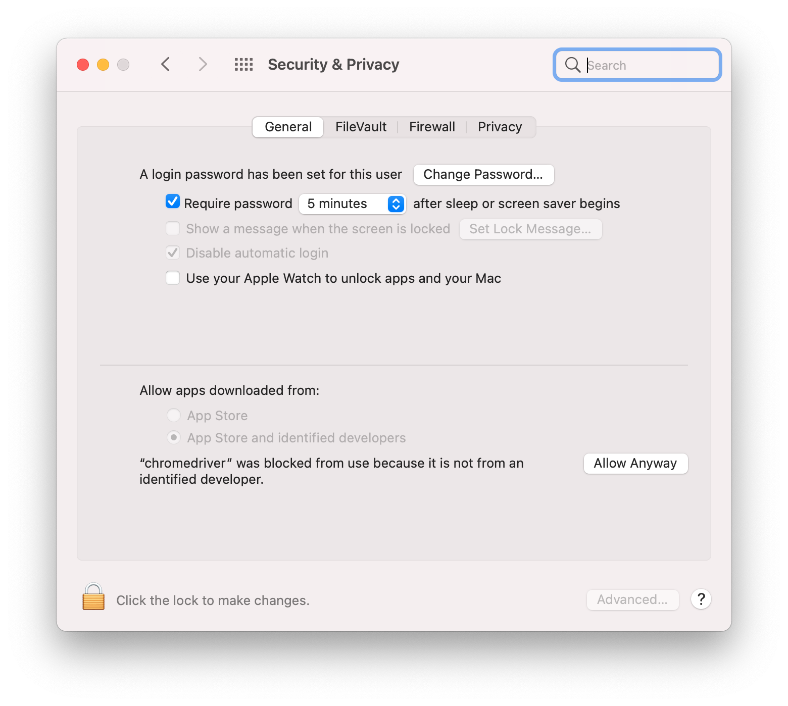

# AutoTest

AutoTest applied Selenium automated testing framework to validate web applications across different browsers and platforms. Based on the designed test strategy, AutoTest will create an HTML test report when the test is done. 

Before running the test, please use correct webdrivers and ensure all python dependencies are installed. Follow the instruction below to set up the testing enviroment.

## Test Strategy

For the Test Scope (Warranty checking input), the following test cases are designed:

| Test Cases                | Description                                                                                                         |
|---------------------------|---------------------------------------------------------------------------------------------------------------------|
| testEmptyInput            | Test the input checking mechanism. If the input is empty, the error message should be shown.                        |
| testInputLength           | Test the input checking mechanism. If the input length is too short, the error message should be shown.             |
| testInvalidInput          | Test the input checking mechanism. If the input contains invalid characters, the error message should be shown.     |
| testLengthAndInvalidInput | If the input length is not enough and contains invalid characters, both error messages should be shown.             |
| testValidSerialNumber     | Make sure all valid serial numbers can be found. Assume all valid serial numbers are recorded in "ValidSerial.json" (includes the given serial numbers 186232437 and 1863552437) |

In order to make sure the "Warranty checking function" works correctly on most browsers, all test cases above will run on Google Chrome, Microsoft Edge and Safari respectively.

## Enviroment Setup

### Download Webdrivers
* Check the browser version and download the corresponding webdrivers. Please find and download the corresponding webdrivers from the following links directly.

| Browser  | Links                                                                 |
|----------|-----------------------------------------------------------------------|
| Chrome  | [https://chromedriver.chromium.org/downloads](https://chromedriver.chromium.org/downloads)                           |
| Safari  | [https://webkit.org/blog/6900/webdriver-support-in-safari-10/](https://webkit.org/blog/6900/webdriver-support-in-safari-10/)          |
| Edge    | [https://developer.microsoft.com/en-us/microsoft-edge/tools/webdriver/](https://developer.microsoft.com/en-us/microsoft-edge/tools/webdriver/) |


* Make sure the webdriver and the "autoTest.py" are in the same directory. If you are using Windows, please download both "chromedriver.exe" and "msedgedriver.exe". If you are using macOS, downloading "chromedriver" is enough.
(Note: It's no need to download webdriver for Safari browser. Instead, you have to check if the "safaridriver" is correctly under "/usr/bin/" directory.)

* For macOS users, enable the "Remote Automation" of Safari browser is necessary. Please follow the screenshot below to enable it. If the "Develop" menu is not shown in the menu bar, please go to Safari -> Preferences -> Advanced to enable the Develop menu.


* Besides, the chromedriver is blocked by macOS's security. You have to enter "Security & Privacy" then press "Allow Anyway" button to enable it.


### Install Dependencies

* All required dependencies are included in the "requirements.txt" file. Please find the "requirements.txt" file under "windows" and "mac" folder respectively. You can easily install the required Python dependencies by the command below:

```
pip install -r requirements.txt
```


## Run The Test

* The autoTest.py is written in Python3. Please confirm and use the correct Python version for running. 

* Make sure the webdrivers(chromedriver and msedgedriver), autoTest.py, HTMLTestRunner_PY3.py and ValidSerial.json are in the same directory.

* For Windows users, you can execute the "python autoTest.py" under the "windows" folder directly.(Remenber to replace the webdriver with the correct version before running)

* For macOS users, please operate under the "mac" folder. If you are using Chrome version 102, you can directly run the "autoTest.py" under the "mac" folder; otherwise, you must replace the webdriver with the correct version before running.

* Run the "autoTest.py":

```
python autoTest.py
```
* If you are using macOS, you can also use the command below:

```
./autoTest.py
```
* For macOS users, if the warnning message "macOS cannot verify the developer of 'chromedriver'" shows, please press "Open" button to continue running.


* After running the command above, the autoTest will start. The test report will be created in HTML format when the test is finished.

## Test Report

The HTML report will be created in the same directory. The report looks like the picture below:


## Defect Report

The defect reports are created in the "defect_report" folder and written in Word file. The screenshot and testing logs are all attached.